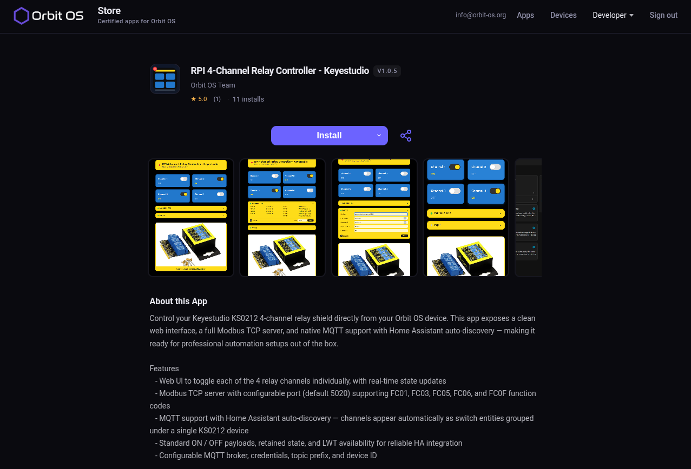

# RPI 4-Channel Relay Controller — Keyestudio KS0212

Web UI, Modbus TCP server and MQTT Home Assistant integration for the [Keyestudio KS0212](https://wiki.keyestudio.com/Ks0212_keyestudio_RPI_4-channel_Relay_Shield) 4-channel relay shield on Raspberry Pi, built as an [Orbit OS](https://www.orbit-os.org) application.

## Install

**Ready to use — no build required.**
Install directly from the Orbit OS Store:

### [➜ Get it on the Orbit OS Store](https://store.orbit-os.org/app.html?slug=rpi-4ch)



The source code is available here for reference, customisation and contributions.

> Created with [Orbit Studio v0.4.6](https://www.orbit-os.org/downloads.html)

## Features

- **Web UI** — control and monitor all 4 relays from a browser, with real-time state via SSE
- **Modbus TCP** — FC01 (Read Coils), FC03 (Read Holding Registers), FC05 (Write Single Coil), FC06 (Write Single Register), FC0F (Write Multiple Coils)
- **MQTT / Home Assistant** — auto-discovery, `ON`/`OFF` command and state topics, availability (LWT), retain
- **Board check** — warns at startup if the detected board does not look like a Raspberry Pi

## Hardware

- Raspberry Pi (3, 4 or 5)
- [Keyestudio KS0212](https://wiki.keyestudio.com/Ks0212_keyestudio_RPI_4-channel_Relay_Shield) 4-channel relay shield

### GPIO mapping (BCM)

| Channel | GPIO (BCM) |
|---------|-----------|
| CH1     | 4         |
| CH2     | 22        |
| CH3     | 6         |
| CH4     | 26        |

## Requirements

- [Orbit OS](https://www.orbit-os.org) running on the Raspberry Pi
- [Orbit Studio](https://www.orbit-os.org/studio) VS Code extension (for build & deploy)
- Go 1.25+

## Build & Deploy

Open the project in VS Code with the Orbit Studio extension and use the Orbit sidebar, or run the commands:

```
Orbit: Build ORB
Orbit: Deploy to device
```

Before building, set `deviceHost` in `orbit.project.json` to your Raspberry Pi's IP address.

## Web UI

Available at `http://<device-ip>/rpi-4ch`

## Modbus TCP

Default port: **5020** (configurable via Web UI, saved to `relay4_config.json` on the device).

| Coil | Channel |
|------|---------|
| 0    | CH1     |
| 1    | CH2     |
| 2    | CH3     |
| 3    | CH4     |

## MQTT / Home Assistant

Configure broker address, username, password, topic prefix and device ID via the Web UI.
Home Assistant auto-discovery is published on connect.

Topic format:
- State: `<prefix>/<device_id>/<ch>/state`
- Command: `<prefix>/<device_id>/<ch>/set` — payload `ON` or `OFF`
- Availability: `<prefix>/<device_id>/availability` — `online` / `offline`

## Project structure

```
cmd/rpi_4ch_relay_keyestudio/   — application source (main.go, mqtt.go)
  webui/                        — embedded web UI (index.html)
  img/                          — embedded assets
  orb/                          — launcher icon
cmd/certs/grpc/                 — mTLS dev certificates (not committed)
orbit-os-sdk-go/                — Orbit OS SDK (local copy, v26)
orbit.project.json              — Orbit Studio project config (set deviceHost)
```

## License

[GNU General Public License v3.0](LICENSE) — Copyright (C) 2026 Orbit OS <orbit-os.org>
